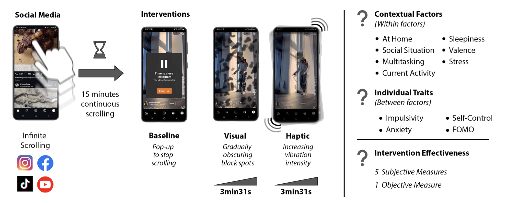
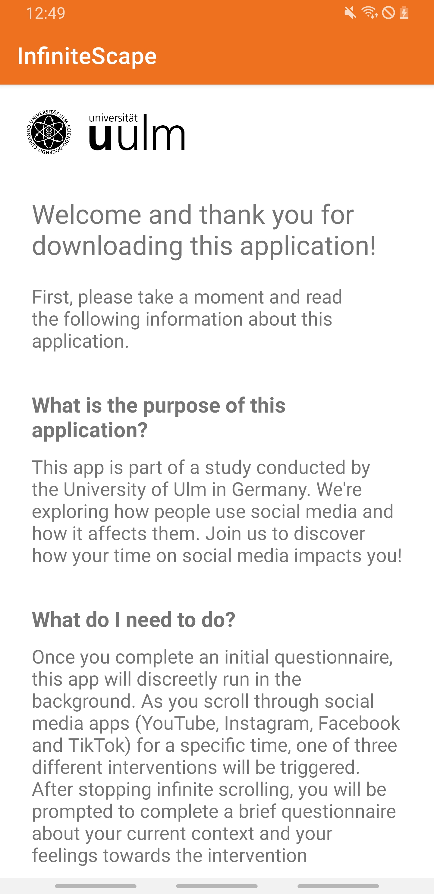
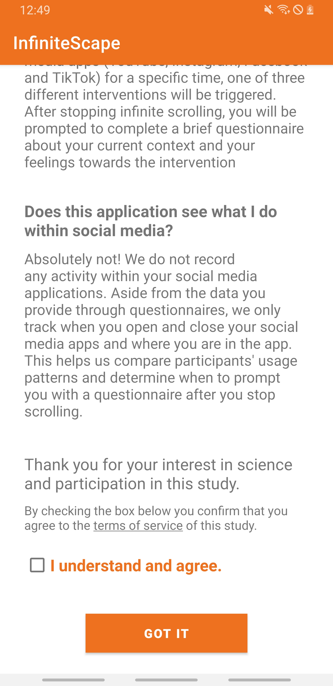
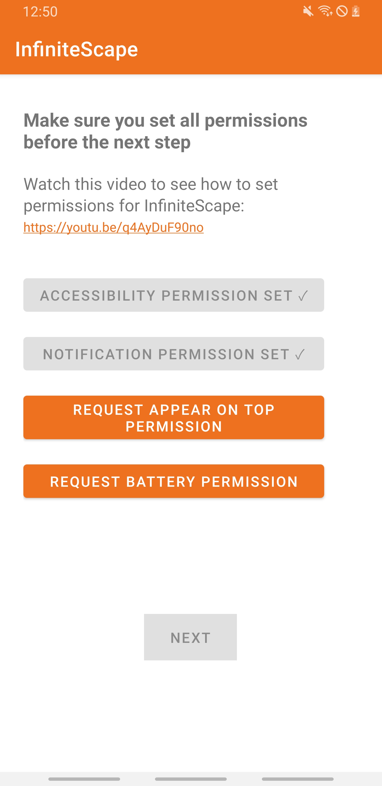
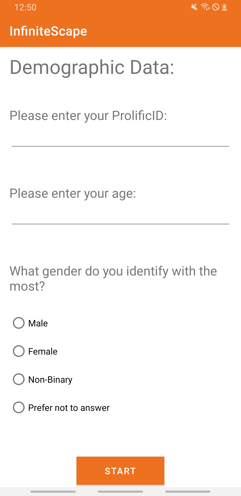
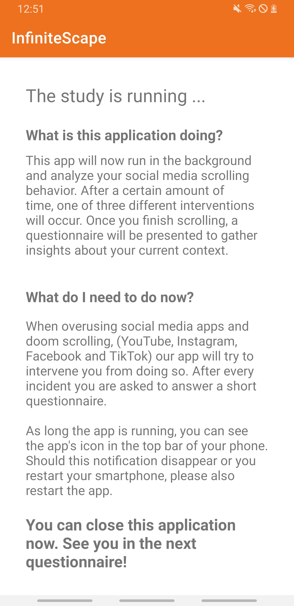

# Can't Stop: How Context and Individual Traits Influence Effectiveness of Different Gradual Interventions for Infinite Scrolling on Short-Form Video Platforms

Published at [IMWUT](https://dl.acm.org/journal/imwut) (Proceedings of the ACM on Interactive, Mobile, Wearable and Ubiquitous Technologies), September 2026.
Paper preprint: [arXiv:2607.15818](https://arxiv.org/abs/2607.15818)


## Authors
[Luca-Maxim Meinhardt](https://github.com/luca-maxim), [Manuela Dragic](https://github.com/ManuelaDragic), [Mark Colley](https://github.com/M-Colley), [Kai Lukoff](https://github.com/klukoff), Enrico Rukzio

## Abstract
Infinite scrolling on short-form video platforms like TikTok encourages prolonged engagement and post-usage regret. Interventions aim to mitigate such behavior, but their effectiveness may depend on the interplay between intervention type, contextual factors, and individual traits. In a 7-day within-subject randomized field study (N=104), we compared a baseline pop-up and two gradually intensifying design frictions (visual and haptic). We evaluated behavioral changes and user experience using objective and subjective measures. Results showed that the pop-up was initially effective but quickly lost impact, whereas the visual gradual intervention sustained subjective ratings the longest. Bayesian modeling revealed that self-regulation traits moderate how participants responded to the three intervention types. For participants with low impulsivity, the type of intervention had little influence on its subjective effectiveness. For participants with high impulsivity, however, differences between intervention types were substantial, with the explicit baseline pop-up being most effective compared to the novel gradual interventions. Contextual factors, in contrast, showed little influence. These findings suggest that intervention modality and individual differences in self-regulation shape intervention effectiveness.



## Interventions
After 15 minutes of uninterrupted scrolling, one of **three interventions** was triggered to mitigate infinite scrolling: a baseline pop-up intervention, a visual graual intervention, or a haptic gradual intervention. The two gradual interventions (visual and haptic) increased in intensity over a period of 3 minutes and 31 seconds.
### Baseline Intervention
Modeled after standard screen-time reminders like TikTok and Instagram, this intervention displays a pop-up overlay informing users it is time to take a break. Users can dismiss the message via a “Dismiss” button to continue scrolling.  

### Visual Intervention
This intervention gradually obscures the screen with semi-transparent black spots that appear slowly, subtly disrupting the scrolling experience without abrupt interruption.  

### Haptic Intervention
This intervention delivers subtle vibrations that gradually increase in intensity and frequency, gently encouraging users to disengage from scrolling.  


## Measures
- **Individual traits** (between-subject: impulsivity, anxiety, self-control, FOMO) were collected separately from this app, outside this codebase.
- **Contextual factors** (within-subject: at home, social situation, multitasking, current activity, sleepiness, valence, stress) and the **5 subjective intervention-effectiveness measures** (autonomy, sense of agency, satisfaction, goal alignment, usefulness in situation) were collected right after each intervention, via the in-app questionnaire participants had to fill out once they stopped scrolling (see [`rhsci1_activity.kt`](Android%20Application/app/src/main/java/com/uniulm/social_media_interventions/rhsci1_activity.kt)).
- The **objective measure** was responsiveness — how long participants kept scrolling after an intervention appeared before closing the app — tracked automatically by the app itself (see `startDelayTimer`/`stopDelayTimer` in [`AppCheckerService.kt`](Android%20Application/app/src/main/java/com/uniulm/social_media_interventions/AppCheckerService.kt)).

## Repository Structure
- [`Android Application/`](Android%20Application/) — the Android app (`com.uniulm.social_media_interventions`) used to run the field study: it detects short-form video sessions via an accessibility service, triggers one of the three interventions after 15 minutes of uninterrupted scrolling, and logs in-app questionnaires to Firebase.
- [`Study Data/`](Study%20Data/) — the anonymized study data ([`main_data.csv`](Study%20Data/data/main_data.csv), [`pilot_data.csv`](Study%20Data/data/pilot_data.csv)) and the R analysis script ([`Analysis.R`](Study%20Data/Analysis.R)) used to produce the paper's results.
- [`images/`](images/) — screenshots of the three interventions and the app's onboarding/questionnaire flow, shown above.

## Setting Up the Android App

Follow these steps in order — the app will not build without a Firebase project (Step 2).

### Prerequisites
- [Android Studio](https://developer.android.com/studio) (recent version recommended)
- An Android phone or emulator running **Android 8.0 (API 26) or newer**
- A free [Google/Firebase account](https://console.firebase.google.com/)

### Step 1: Get the code
Clone this repository, or download it as a ZIP from GitHub (**Code → Download ZIP**) and unzip it.

### Step 2: Create a Firebase project
The app stores questionnaire answers in Firebase, so it needs its own Firebase project to connect to.
1. Go to the [Firebase console](https://console.firebase.google.com/) and click **Add project** (any name is fine).
2. Once it's created, click **Add app → Android**.
3. For the **Android package name**, enter exactly: `com.uniulm.social_media_interventions`.
4. Firebase will offer you a `google-services.json` file to download — download it.
5. Move that file into `Android Application/app/google-services.json` in this repository (a template showing the expected format is at [`google-services.json.example`](Android%20Application/app/google-services.json.example); the real file is gitignored so it's never accidentally shared).
6. In the Firebase console sidebar, open **Firestore Database** and click **Create database**. Start it in *test mode*.

> **Note on Firestore rules:** Firebase's default "test mode" rules only allow read/write access until a fixed expiry date (visible under **Firestore Database → Rules**). If the app stops saving data after a while, this is the most likely reason — open the Rules tab and extend the date.

### Step 3: Open the project in Android Studio
Open Android Studio, choose **Open**, and select the `Android Application` folder (not the top-level repository folder). Wait for Gradle to finish syncing — this can take a few minutes the first time, especially on a fresh install.

### Step 4: Run the app
Connect an Android phone (with USB debugging enabled) or start an emulator from Android Studio's **Device Manager**, then click the green **Run ▶** button. Alternatively, from a terminal:
```bash
cd "Android Application"
./gradlew assembleDebug
```

### Step 5: First launch
The first time the app runs, it walks through a short onboarding flow before the study actually starts:

1. **Consent.** The app opens on a welcome/consent screen with a link to the full terms of consent (see [`ToS_activity.kt`](Android%20Application/app/src/main/java/com/uniulm/social_media_interventions/ToS_activity.kt)). Participants must tick a checkbox confirming they agree before continuing — trying to proceed without it shows a reminder to check the box first (see [`WelcomeActivity.kt`](Android%20Application/app/src/main/java/com/uniulm/social_media_interventions/WelcomeActivity.kt)).
   <br> 
2. **Permissions.** Because the app needs to detect and interrupt scrolling in other apps, it requests several sensitive permissions: Usage Access, "Draw over other apps", Accessibility Service, Notifications, and battery-optimization exemption. Each one has its own screen with instructions (see [`PermissionActivity.kt`](Android%20Application/app/src/main/java/com/uniulm/social_media_interventions/PermissionActivity.kt)) — just follow them and tap each button in order.
   <br>
3. **Participant details.** The study was run with participants recruited via [Prolific](https://www.prolific.com/), so the app then asks for the participant's **Prolific ID**, **age**, and **gender** (see [`StartActivity.kt`](Android%20Application/app/src/main/java/com/uniulm/social_media_interventions/StartActivity.kt)) before continuing to the main study screen. For local testing, any values can be entered here.
   <br>

### Step 6: During the study
Once onboarding is complete, the app shows a short explanation screen and then runs in the background:



### Troubleshooting
- **Gradle sync fails with an "Unsupported class file major version" error:** this project uses an older Gradle version that doesn't support JDK 21. Go to **Settings → Build, Execution, Deployment → Build Tools → Gradle** and set the **Gradle JDK** to a JDK 17 install.
- **Questionnaire answers aren't showing up in Firestore:** double-check your Firestore security rules haven't expired (see the note in Step 2).

## Reproducing the Analysis
The statistical analysis (mixed models, Bayesian modeling with `brms`) is in [`Study Data/Analysis.R`](Study%20Data/Analysis.R) and reads [`main_data.csv`](Study%20Data/data/main_data.csv) and [`pilot_data.csv`](Study%20Data/data/pilot_data.csv). Open it in RStudio and install the required packages:
```r
install.packages(c("tidyverse", "lme4", "lmerTest", "mixedpower", "performance",
                    "report", "readr", "rstudioapi", "emmeans", "brms",
                    "bayestestR", "xtable", "survival", "survminer",
                    "tidybayes", "psych"))
```

## Citation
If you use this code or dataset, please cite the paper:
```bibtex
@article{meinhardt2026cantstop,
  title     = {Can't Stop: How Context and Individual Traits Influence Effectiveness of Different Gradual Interventions for Infinite Scrolling on Short-Form Video Platforms},
  author    = {Meinhardt, Luca-Maxim and Dragic, Manuela and Colley, Mark and Lukoff, Kai and Rukzio, Enrico},
  journal   = {Proceedings of the ACM on Interactive, Mobile, Wearable and Ubiquitous Technologies (IMWUT)},
  year      = {2026},
  month     = {sep},
  note      = {arXiv:2607.15818}
}
```

## License
This project is released under [CC0 1.0](LICENSE).
