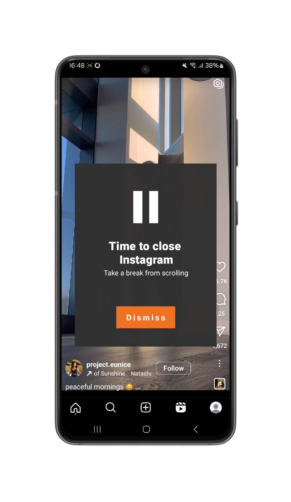
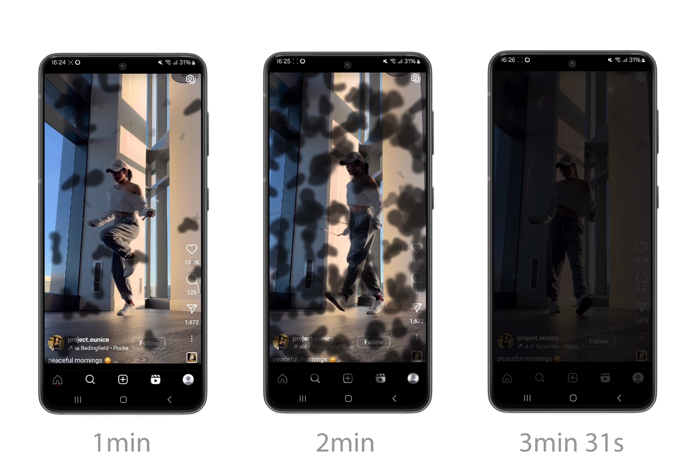
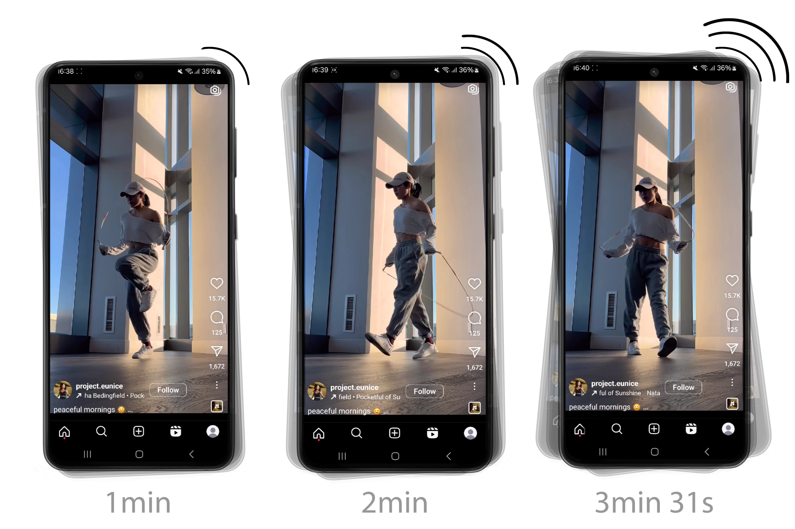

# Can't Stop: How Context and Individual Traits Influence Effectiveness of Different Gradual Interventions for Infinite Scrolling on Short-Form Video Platforms

Published at [IMWUT](https://dl.acm.org/journal/imwut) (Proceedings of the ACM on Interactive, Mobile, Wearable and Ubiquitous Technologies), September 2026.
Paper preprint: [arXiv:2607.15818](https://arxiv.org/abs/2607.15818)


## Authors
[Luca-Maxim Meinhardt](https://github.com/luca-maxim), [Manuela Dragic](https://github.com/ManuelaDragic), [Mark Colley](https://github.com/M-Colley), [Kai Lukoff](https://github.com/klukoff), Enrico Rukzio

## Abstract
Infinite scrolling on short-form video platforms like TikTok encourages prolonged engagement and post-usage regret. Interventions aim to mitigate such behavior, but their effectiveness may depend on the interplay between intervention type, contextual factors, and individual traits. In a 7-day within-subject randomized field study (N=104), we compared a baseline pop-up and two gradually intensifying design frictions (visual and haptic). We evaluated behavioral changes and user experience using objective and subjective measures. Results showed that the pop-up was initially effective but quickly lost impact, whereas the visual gradual intervention sustained subjective ratings the longest. Bayesian modeling revealed that self-regulation traits moderate how participants responded to the three intervention types. For participants with low impulsivity, the type of intervention had little influence on its subjective effectiveness. For participants with high impulsivity, however, differences between intervention types were substantial, with the explicit baseline pop-up being most effective compared to the novel gradual interventions. Contextual factors, in contrast, showed little influence. These findings suggest that intervention modality and individual differences in self-regulation shape intervention effectiveness.

## Interventions
After 15 minutes of uninterrupted scrolling, one of **three interventions** was triggered to mitigate infinite scrolling: a baseline pop-up intervention, a visual graual intervention, or a haptic gradual intervention. The two gradual interventions (visual and haptic) increased in intensity over a period of 3 minutes and 31 seconds.
### Baseline Intervention
Modeled after standard screen-time reminders like TikTok and Instagram, this intervention displays a pop-up overlay informing users it is time to take a break. Users can dismiss the message via a “Dismiss” button to continue scrolling.  

### Visual Intervention
This intervention gradually obscures the screen with semi-transparent black spots that appear slowly, subtly disrupting the scrolling experience without abrupt interruption.  

### Haptic Intervention
This intervention delivers subtle vibrations that gradually increase in intensity and frequency, gently encouraging users to disengage from scrolling.  


## Repository Structure
- [`Android Application/`](Android%20Application/) — the Android app (`com.uniulm.social_media_interventions`) used to run the field study: it detects short-form video sessions via an accessibility service, triggers one of the three interventions after 15 minutes of uninterrupted scrolling, and logs in-app questionnaires to Firebase.
- [`Study Data/`](Study%20Data/) — the anonymized study data ([`main_data.csv`](Study%20Data/data/main_data.csv), [`pilot_data.csv`](Study%20Data/data/pilot_data.csv)) and the R analysis script ([`Analysis.R`](Study%20Data/Analysis.R)) used to produce the paper's results.
- [`images/`](images/) — screenshots of the three interventions, shown above.

## Setting Up the Android App

### Prerequisites
- [Android Studio](https://developer.android.com/studio) (Flamingo or newer recommended)
- JDK 8+
- An Android device or emulator running **API 26+** (target/compile SDK 30/33)

### 1. Firebase
The app uses Firebase (Firestore, Auth, Analytics) to store questionnaire responses.
1. Create a project in the [Firebase console](https://console.firebase.google.com/).
2. Add an Android app to it with package name `com.uniulm.social_media_interventions`.
3. Download the generated `google-services.json` and place it at [`Android Application/app/google-services.json`](Android%20Application/app/google-services.json.example) (use [`google-services.json.example`](Android%20Application/app/google-services.json.example) as a template — this file is gitignored so your own keys never get committed).
4. Enable **Firestore** and **Authentication** for the project.

### 2. Study backend (optional)
[`rhsci5_activity.kt`](Android%20Application/app/src/main/java/com/uniulm/social_media_interventions/rhsci5_activity.kt) additionally POSTs a CSV summary to a self-hosted HTTP endpoint protected with HTTP Basic Auth. This is only needed if you want to reproduce that server-side logging.
1. Copy [`Android Application/app/study.properties.example`](Android%20Application/app/study.properties.example) to `Android Application/app/study.properties` (gitignored).
2. Fill in `STUDY_SERVER_URL`, `STUDY_SERVER_USERNAME`, and `STUDY_SERVER_PASSWORD` for your own server.

If you skip this step, the app builds and runs fine — the build falls back to placeholder values and only that specific upload will fail.

### 3. Build & run
```bash
cd "Android Application"
./gradlew assembleDebug
```
or open the `Android Application` folder in Android Studio and run the `app` configuration.

> **Known issue:** the build currently fails to resolve `com.rvalerio:fgchecker:1.1.0` (used by [`AppCheckerService.kt`](Android%20Application/app/src/main/java/com/uniulm/social_media_interventions/AppCheckerService.kt) to detect the foreground app — the core signal that triggers interventions). Its two host repositories (`dl.bintray.com`, shut down in 2021, and `maven.owncloud.org`) are both dead, and the library's original GitHub repo has been deleted. To build the app you currently need to either vendor a replacement for `fgchecker`'s `AppChecker.getForegroundApp()` (a standard `UsageStatsManager` query — the app already requests `PACKAGE_USAGE_STATS`) or locate a working mirror of the original artifact.

### Permissions
Because the app needs to detect and interrupt scrolling in third-party apps, it requests several sensitive permissions at runtime, including Usage Access, "Draw over other apps", Accessibility Service, and Device Admin. These are explained to participants in-app before being requested (see `strings.xml` and the permission activities).

## Reproducing the Analysis
The statistical analysis (mixed models, Bayesian modeling with `brms`) is in [`Study Data/Analysis.R`](Study%20Data/Analysis.R) and reads [`main_data.csv`](Study%20Data/data/main_data.csv) and [`pilot_data.csv`](Study%20Data/data/pilot_data.csv). Open it in RStudio and install the required packages:
```r
install.packages(c("tidyverse", "lme4", "lmerTest", "mixedpower", "performance",
                    "report", "readr", "rstudioapi", "emmeans", "brms",
                    "bayestestR", "xtable", "survival", "survminer",
                    "tidybayes", "psych"))
```

## Citation
If you use this code or dataset, please cite the paper:
```bibtex
@article{meinhardt2026cantstop,
  title     = {Can't Stop: How Context and Individual Traits Influence Effectiveness of Different Gradual Interventions for Infinite Scrolling on Short-Form Video Platforms},
  author    = {Meinhardt, Luca-Maxim and Dragic, Manuela and Colley, Mark and Lukoff, Kai and Rukzio, Enrico},
  journal   = {Proceedings of the ACM on Interactive, Mobile, Wearable and Ubiquitous Technologies (IMWUT)},
  year      = {2026},
  month     = {sep},
  note      = {arXiv:2607.15818}
}
```

## License
This project is released under [CC0 1.0](LICENSE).
